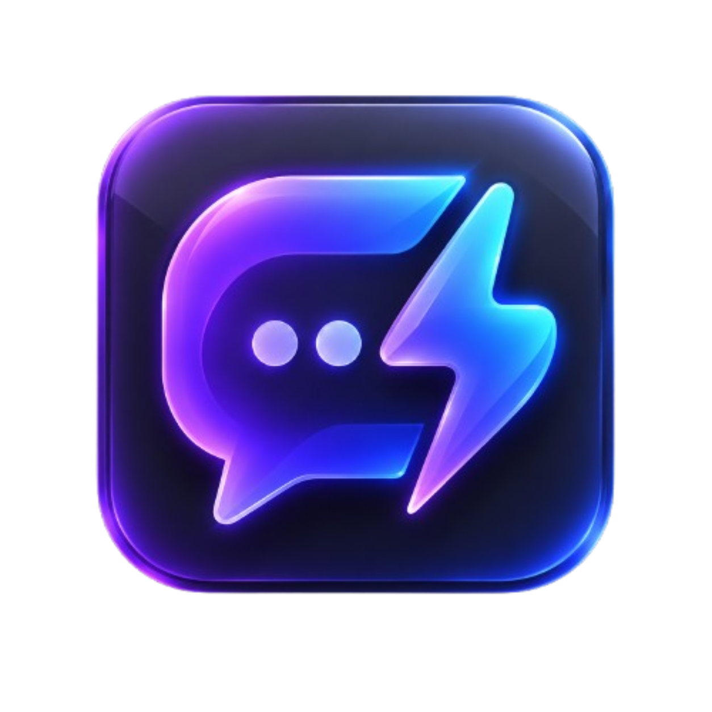
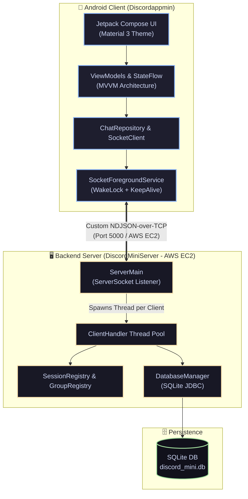

<div align="center">

<br/>



# ⚡ DiscordMini

### *Real-Time Distributed Messaging App — Built from Scratch*

<br/>

[](https://github.com/GPramodh07/Discord-Mini-App/releases/download/v1.0.0/DiscordMini_v1.0.apk)

<br/>

[](https://developer.android.com/jetpack/compose)
[](https://kotlinlang.org/)
[](https://openjdk.org/)
[](https://www.sqlite.org/)
[](https://aws.amazon.com/)
[](https://en.wikipedia.org/wiki/Transmission_Control_Protocol)
[](LICENSE)

<br/>

> **DiscordMini** is a full-stack real-time messaging ecosystem featuring a modern **Jetpack Compose Android Client** powered by an **Android Foreground Service** connected to a multithreaded **Java TCP Socket Backend** deployed on **AWS EC2**.

<br/>

<a href="https://github.com/GPramodh07/Discord-Mini-App/releases/download/v1.0.0/DiscordMini_v1.0.apk">
  
</a>

</div>

---

## 📸 App Showcase

<div align="center">

| 💬 **Direct Messages** | 📩 **Private Chat** | 👥 **Group Channels** | 💬 **Group Chat** |
|:---:|:---:|:---:|:---:|
|  |  |  |  |

</div>

---

## ✨ Features Highlight

- 🚀 **Production Ready APK Release**: Download and run instantly on any Android device ([**Download v1.0.0 APK**](https://github.com/GPramodh07/Discord-Mini-App/releases/download/v1.0.0/DiscordMini_v1.0.apk)).
- ☁️ **AWS Cloud VPS Deployment**: Backend running live on AWS EC2 (`3.106.255.165:5000`) with fallback support for local USB ADB reverse debugging (`127.0.0.1`).
- 🔋 **Android Foreground Service & Battery Optimization**: Includes `SocketForegroundService` with a CPU `PARTIAL_WAKE_LOCK` to keep TCP sockets connected when minimized, locked, or running across Android App Clones.
- 💬 **Strict 1:1 DMs & Group Channels**: Direct messaging isolated cleanly from multi-user group chats.
- 🗑️ **Cross-Client Real-Time Delete**: Delete messages for everyone across all connected clients with SQLite DB synchronization.
- 🟢 **Dynamic Presence Broadcasts**: Live green/gray online status indicators for connected contacts.
- 🗄️ **SQLite Message & Group History Sync**: Automatically restores past conversations, group channels, and offline queued messages on login.
- 🔀 **Multithreaded Concurrent Server**: Built with custom NDJSON protocol and concurrent session/group registries (`SessionRegistry`, `GroupRegistry`).

---

## 🏗️ System Architecture



---

## 📲 Quick Download & Test Credentials

### 1️⃣ Download APK

Click the button below to download the compiled Android APK directly to your phone:

<div align="center">

<a href="https://github.com/GPramodh07/Discord-Mini-App/releases/download/v1.0.0/DiscordMini_v1.0.apk">
  
</a>

</div>

### 2️⃣ Pre-Seeded Test Credentials

Log in with any of the pre-configured accounts:

| 👤 Username | 🔑 Password | 📌 Roles / Notes |
|:-----------:|:-----------:|:-----------------|
| `alice` | `123` | Active User (DM & Groups) |
| `bob` | `456` | Active User (DM & Groups) |
| `carl` | `789` | Active User (DM & Groups) |
| `don` | `101` | Active User (DM & Groups) |

> 💡 **Tip**: Log into two accounts simultaneously (using two phones or Phone App Clones) to test live 2-way real-time messaging, group creation, online presence, and background message delivery!

---

## 🛠️ Repository Structure

```
DiscordMini/
├── assets/                     # 🎨 App Logo & Showcase Screenshots
├── Discordappmin/              # 📱 Android Client (Kotlin + Jetpack Compose)
│   ├── app/
│   │   ├── src/main/java/com/example/discordappmin/
│   │   │   ├── network/        # SocketClient & SocketPacket
│   │   │   ├── repository/     # ChatRepository (IP Config & State)
│   │   │   ├── service/        # SocketForegroundService (Background Keep-Alive)
│   │   │   └── ui/             # Jetpack Compose Screens & ViewModels
│   └── build.gradle.kts
│
└── DiscordMiniServer/          # 🖥️ Backend Server (Java 17 + SQLite)
    ├── src/main/java/com/discordmini/server/
    │   ├── db/                 # DatabaseManager (SQLite JDBC)
    │   ├── handler/            # ClientHandler (NDJSON Protocol Parser)
    │   └── registry/           # SessionRegistry & GroupRegistry
    └── lib/                    # json.jar, sqlite.jar
```

---

## 💻 Building from Source

### Running the Java Server

```bash
cd DiscordMiniServer

# Compile server code
javac -d bin -cp "lib/*" $(find src -name "*.java")

# Run the server on port 5000
java -cp "bin:lib/*" com.discordmini.server.ServerMain
```

### Local USB ADB Debugging (Optional)

If running the backend locally instead of AWS EC2:

```bash
# Reverse TCP port 5000 from phone to PC
~/Android/Sdk/platform-tools/adb reverse tcp:5000 tcp:5000
```

---

## 📄 License

Distributed under the **MIT License**. See `LICENSE` for more information.

<div align="center">

Crafted with 💜 **Kotlin** & ☕ **Java** &nbsp;•&nbsp; **DiscordMini Monorepo**

</div>
