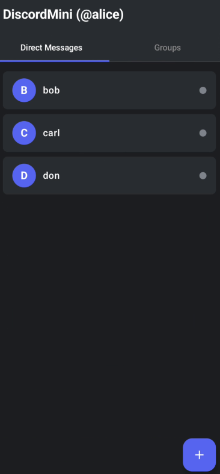
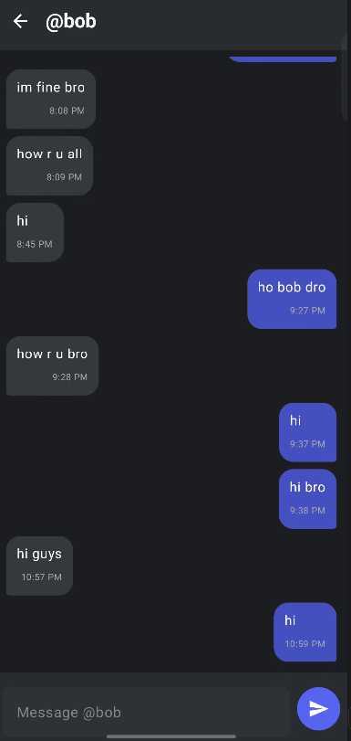
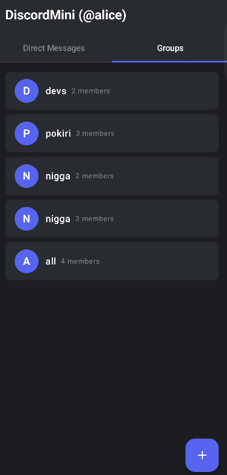
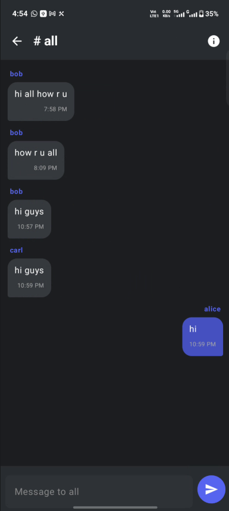
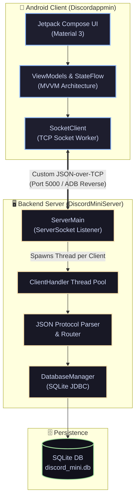

<div align="center">

<br/>


# DiscordMini

### *"Real-time chat, built from scratch."*

[](https://developer.android.com/jetpack/compose)
[](https://kotlinlang.org/)
[](https://openjdk.org/)
[](https://www.sqlite.org/)
[](https://en.wikipedia.org/wiki/Transmission_Control_Protocol)
[](LICENSE)

> A full-stack real-time chat application — **Android Client** + **Multi-threaded Java TCP Server** — built as a mini distributed systems project.

</div>

---

<br/>

<div align="center">

|  |  |  |  |
|:---:|:---:|:---:|:---:|
| **DM List** | **Direct Chat** | **Groups** | **Group Chat** |

</div>

<br/>

---

## 📖 Overview

**DiscordMini** is a lightweight clone of real-time messaging inspired by Discord, built entirely from scratch without Firebase or third-party messaging services. It uses a **custom JSON-over-TCP protocol** to deliver instant messages between users through a multi-threaded Java server.

The Android client is built with modern **Jetpack Compose + Material 3**, following clean MVVM architecture. The backend is a raw Java socket server with **SQLite persistence** — no frameworks, no shortcuts.

---

## 🏗️ System Architecture



---

## ✨ Key Features

| Feature | Description |
|---------|-------------|
| 💬 **Direct Messaging** | One-to-one real-time chat between registered users. |
| 👥 **Group Channels** | Create and join group chats with multiple members instantly. |
| 🔐 **User Authentication** | Secure registration and login with server-side session management. |
| ⚡ **Custom TCP Protocol** | JSON-over-TCP for fast, lightweight real-time communication. |
| 🗄️ **SQLite Persistence** | All users, groups, and messages are persisted server-side. |
| 🎨 **Material 3 Dark UI** | Sleek dark-themed Android UI built fully in Jetpack Compose. |
| 🔀 **Multi-threaded Server** | Concurrent client connections handled with dedicated client handler threads. |

---

## 🏗️ Repository Structure

```
DiscordMini/
├── Discordappmin/              # 📱 Android Client (Kotlin + Jetpack Compose)
│   ├── app/
│   │   ├── ui/                 # Compose Screens & Components
│   │   ├── viewmodel/          # MVVM ViewModels + StateFlow
│   │   └── network/            # TCP Socket Client
│   └── build.gradle.kts
│
├── DiscordMiniServer/          # 🖥️ Backend Server (Java 17 + SQLite)
│   ├── src/
│   │   └── com/discordmini/
│   │       ├── server/         # ServerMain, ClientHandler
│   │       ├── db/             # SQLite Database layer
│   │       └── handlers/       # Message & protocol handlers
│   ├── lib/                    # json.jar, sqlite.jar
│   └── pom.xml
│
└── readme-images/              # 📸 App screenshots
```

---

## 🛠️ Tech Stack

### 📱 Android Client (`Discordappmin`)
- **Language**: Kotlin (JDK 17)
- **UI**: Jetpack Compose + Material 3
- **Architecture**: MVVM + StateFlow
- **Networking**: Raw TCP Sockets (no Retrofit/Firebase)
- **Build**: Gradle Kotlin DSL

### 🖥️ Backend Server (`DiscordMiniServer`)
- **Language**: Java 17
- **Networking**: `ServerSocket` / `Socket` (raw TCP)
- **Protocol**: Custom JSON-over-TCP
- **Database**: SQLite via JDBC
- **Build**: Apache Maven

---

## 🚀 Getting Started

### Step 1 — Run the Backend Server

```bash
# Navigate to the server directory
cd DiscordMiniServer

# Compile (Maven)
mvn clean compile

# Run the server (logs output to /tmp/server.log)
nohup java -cp "target/classes:lib/json.jar:lib/sqlite.jar" \
  com.discordmini.server.ServerMain >> /tmp/server.log 2>&1 &
```

> The server listens on **port 5000** by default.

**Useful server commands:**

| Action | Command |
|--------|---------|
| ▶️ Start server | `nohup java -cp "target/classes:lib/json.jar:lib/sqlite.jar" com.discordmini.server.ServerMain >> /tmp/server.log 2>&1 &` |
| 📋 View logs | `cat /tmp/server.log` |
| 🔍 Check if running | `lsof -i :5000` |
| ⏹️ Stop server | `pkill -f ServerMain` |

---

### Step 2 — Connect Android Device via USB

To run the app on a **physical device** and connect it to your local server over USB:

```bash
# Forward the server port from your PC to the Android device
~/Android/Sdk/platform-tools/adb reverse tcp:5000 tcp:5000
```

> This maps `localhost:5000` on the Android device → your PC's server port `5000`.  
> Run this **after** plugging in your device and **before** launching the app.

**Then:**
1. Open `Discordappmin/` in **Android Studio**
2. Run `adb reverse` (command above)
3. Build & install the app on your device
4. The app will connect to your PC's server automatically via `127.0.0.1:5000`

---

### Step 3 — Login with a Test Account

> ⚠️ **New user registration is not available yet** — it will be added in a future update.  
> Use one of the pre-seeded accounts below to log in:

| 👤 Username | 🔑 Password |
|:-----------:|:-----------:|
| `alice` | `123` |
| `bob` | `456` |
| `carl` | `789` |
| `don` | `101` |

> 💡 You can run the app on **multiple devices / emulators** simultaneously using different accounts to test real-time messaging between users.

---

## 📸 App Screenshots

### Direct Messages

<div align="center">
  
  &nbsp;&nbsp;&nbsp;&nbsp;
  
</div>

<br/>

### Group Chats

<div align="center">
  
  &nbsp;&nbsp;&nbsp;&nbsp;
  
</div>

---

## 📄 License

This project is open-source under the **MIT License**.

---

<div align="center">

Built with ☕ Java & 💜 Kotlin &nbsp;·&nbsp; Distributed Systems Mini Project

</div>
